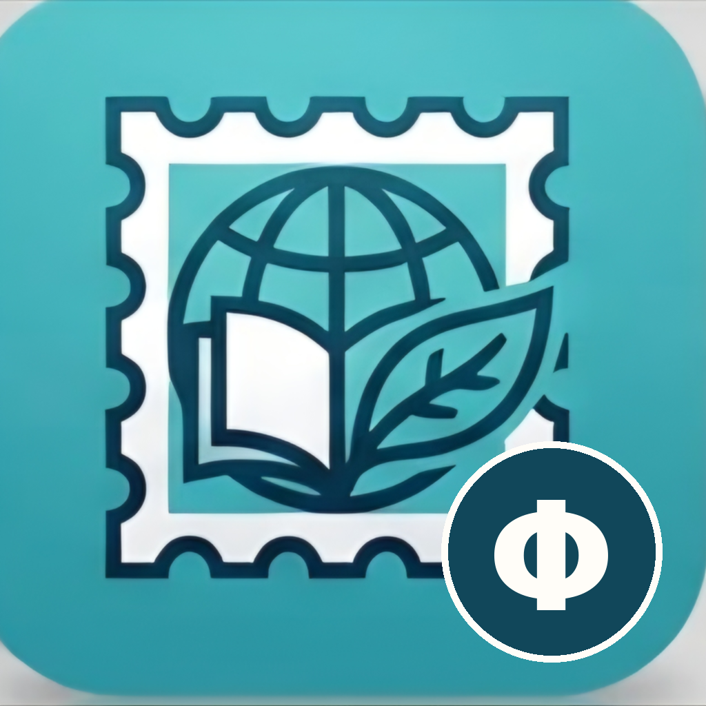

# PhilaPhil – Freund der Philatelie

Briefmarken als Zeitgeschichte. Ein Katalog, der erzählt – kein Katalog, der bewertet.

Webseite: https://bgg-home.de/philaphil/

Jede Marke steht für etwas: ein Ereignis, eine Person, eine Zeit. PhilaPhil nimmt dich an die Hand
und führt in die Zeit der Herausgabe und in das Thema der Marke. Für Bewertung und Spezialwissen
gibt es den MICHEL-Katalog; PhilaPhil erzählt, *warum* es eine Marke gibt und was damals los war.

- Daten bleiben bei dir: kein Konto, kein Abo, keine Werbung, offline nutzbar.
- Offene Formate: JSON pro Jahrgang, SQLite in der App.
- Android, Linux und Windows aus einer Codebasis (Kotlin, Compose Multiplatform).
- Fakten und Themen stammen aus der Wikipedia (CC BY-SA 4.0), Bilder zur Laufzeit von Wikimedia Commons
  mit Lizenzangabe unter jedem Bild. Keine Preise, keine Katalog-Systematik.

<p>
&nbsp;
&nbsp;

</p>


Stand: Bund 1949 bis 2026, Berlin 1948 bis 1990, DDR 1949 bis 1990 und Deutsches Reich 1872 bis 1945, zusammen 8936 Marken und 6877 Themen. Themenkarten mit Kurztext aus der Wikipedia und Anmerkungen aus den Listen, Zeitreise „Was in dem Jahr geschah“, Heute vor Jahren, Suche über alle Gebiete, eigener Bestand und eigene Bilder.

```
daten/     JSON pro Gebiet und Jahrgang (CC BY-SA 4.0), später eigenes Repo briefmarken-daten
tools/     Import aus Wikipedia, Bau der katalog.db
shared/    Kotlin-Kern: Datenbank, Oberfläche (Compose Multiplatform)
app/       Android-Hülle
desktop/   Linux/Windows-Hülle
```

## Daten erzeugen

```
tools/wikipedia_import.py --gebiet bund --alle       # -> daten/bund/<jahr>.json (Gebiete: daten/gebiete.json)
tools/commons_abgleich.py --gebiet bund --alle       # weitere Commons-Bilder, die die Listen nicht verlinken
tools/themen_laden.py                                  # Kurztexte der Themen -> daten/themen.json
tools/wikidata_daten.py                                # Geburt, Tod, Gründung … -> daten/themen_daten.json (Heute vor Jahren)
tools/zeitgeschehen.py                                 # Was in einem Jahr geschah -> daten/zeitgeschehen/<jahr>.json
tools/katalog_bauen.py                                 # -> shared/.../composeResources/files/katalog.db
```

Eigene Ergänzungen zu Themen („Wusstest du?“, eigener Kurztext) stehen in `daten/themen.hand.json`.

Handkorrekturen (Bilder, Hauptthema, Zähnung, Druckart) kommen nach
`daten/<gebiet>/<jahr>.hand.json` und überleben jeden Neuimport.

Lizenz: Code GPL-3.0 (LICENSE), Daten CC BY-SA 4.0 (daten/LICENSE).

Kontakt: Thomas, thomas@bgg-mail.de – Fehler und Wünsche gern auch als Issue.

## Eigene Sammlung

Bestand und eigene Bilder liegen in einem **Sammlungsordner**, den du in den Einstellungen wählst,
zum Beispiel einen Ordner, den Synology Drive zwischen NAS, PC und Handy spiegelt:

```
Sammlungsordner/
  bestand.json          Erhaltung (**, *, ⊙, FDC), Anzahl und Notiz je Marke – offen und lesbar
  Bilder/
    Bund-1031.jpg       eigenes Bild zur MiNr 1031, geht vor dem Commons-Bild
    Bund-1031-2.png     weiteres Bild derselben Marke
```

Eigene Bilder gelten für jede Marke, ob im Besitz oder nicht. Beim Hinzufügen über die App
(Foto oder Galerie am Handy, Datei am PC) wird auf 1600 Pixel verkleinert. Nichts davon landet
im Repo oder in einem Release.

## Pakete

Fertige Pakete liegen bei den [Releases](https://github.com/thobgg/philaphil/releases):

```
PhilaAnd-<version>.apk   Android (ab Android 8)
PhilaWin-<version>.exe   Windows-Installer
PhilaTux-<version>.deb   Debian/Ubuntu
```

Ein Release auf GitHub stößt den Workflow `.github/workflows/release.yml` an, der die drei Pakete baut
und anhängt.

## App bauen

Gradle 8.13 braucht JDK 21 (das System-Java 25 geht nicht):

```
export JAVA_HOME=~/.jdks/jdk-21.0.12+8
./gradlew :desktop:run              # Desktop starten
./gradlew :desktop:packageDeb       # Linux-Paket -> desktop/build/compose/binaries/main/deb/
./gradlew :app:assembleDebug        # Android -> app/build/outputs/apk/debug/app-debug.apk
```

Die Katalog-Datenbank liegt als Ressource in `shared/src/commonMain/composeResources/files/katalog.db`
und wird beim ersten Start in den Datenordner kopiert (Linux: `~/.local/share/philaphil`).
Bilder kommen zur Laufzeit von Wikimedia Commons und landen im Cache (`~/.cache/philaphil/bilder`).
